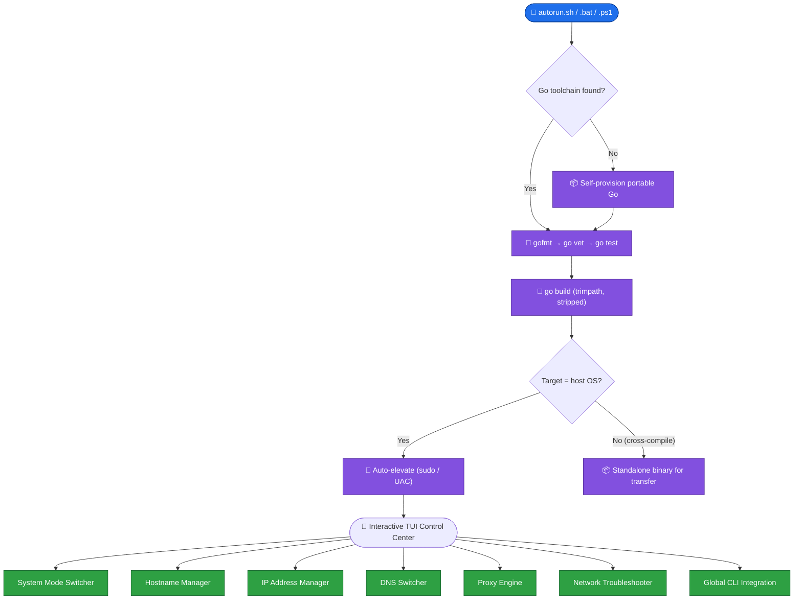
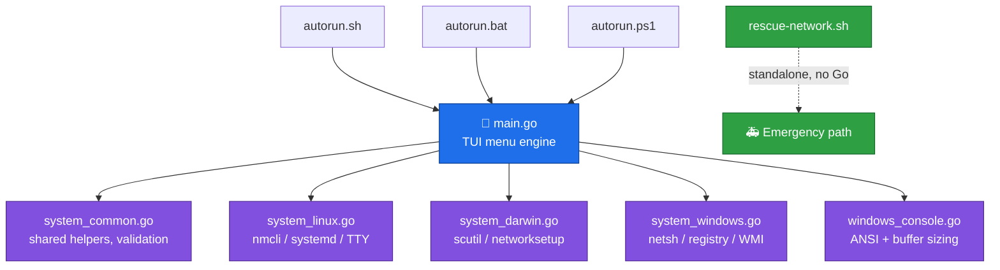

<div align="center">


<a href="https://github.com/ali4210">
  
</a>

<br/>


**A single self-healing Go binary that turns low-level system administration — display mode switching, network configuration, and system identity — into a guided, keyboard-driven terminal UI.**

Built for developers, sysadmins, and network engineers who live in the terminal and need fast, reliable control over the host they're sitting on — without hunting through `netsh`, `nmcli`, `networksetup`, or the registry every time.

<br/>

[**Why**](#why) · [**Features**](#features) · [**Install**](#install) · [**Preview**](#preview) · [**Modules**](#modules) · [**Build System**](#build) · [**Safety**](#safety) · [**Architecture**](#architecture) · [**FAQ**](#faq) · [**Roadmap**](#roadmap)

</div>

---

<a id="glance"></a>

## ⚡ At a Glance

<table align="center">
  <tr>
    <td align="center"><h3>9</h3><sub>Control-center<br/>modules</sub></td>
    <td align="center"><h3>3</h3><sub>Operating systems<br/>(Linux, Windows, macOS)</sub></td>
    <td align="center"><h3>1</h3><sub>Self-healing<br/>Go bootstrap</sub></td>
    <td align="center"><h3>5</h3><sub>Network audit<br/>&amp; auto-heal phases</sub></td>
    <td align="center"><h3>0</h3><sub>Manual `netsh` /<br/>`nmcli` commands</sub></td>
    <td align="center"><h3>1</h3><sub>Offline rescue<br/>script (no Go needed)</sub></td>
  </tr>
</table>

> [!TIP]
> **In 30 seconds:** clone the repo, run `./autorun.sh` (Linux/macOS) or right-click `autorun.bat` → *Run as administrator* (Windows). The wrapper self-provisions a Go toolchain if it can't find one, compiles the binary, and launches it elevated — automatically.

> [!IMPORTANT]
> Prefer PowerShell on Windows? Use **`autorun.ps1`** instead of the batch file — same build pipeline, native PowerShell elevation.

---

<a id="why"></a>

## 🎯 Why Switcher Suite Wizard?

Every OS hides basic control-plane tasks behind a different, unfriendly interface:

- 🖥️ Dropping to a headless TTY to save RAM means memorizing `systemctl isolate multi-user.target`, `chvt`, or editing the Windows `Winlogon` shell key
- 🌐 Setting a static IP means three different tools depending on whether you're on `nmcli`, `networksetup`, or `netsh`
- 🧪 Testing a Burp Suite / mitmproxy proxy means remembering to re-disable it system-wide afterward, on every OS, in a different place
- 🩺 A broken gateway or dead DNS resolver means manually rebuilding `/etc/resolv.conf`, `/etc/hosts`, or the Windows routing table by hand
- 🔁 Repeating all of the above across a Linux box, a Windows workstation, and a MacBook, each with its own syntax

Switcher Suite Wizard puts the whole control plane behind **one keyboard-driven menu**, backed by a single statically-linked Go binary, with **auto-elevation, live diagnostics, and self-healing** built in.

### 🥊 By Hand vs Switcher Suite Wizard

| Situation | 😬 By hand | 🧙 Switcher Suite Wizard |
|---|---|---|
| Drop to a headless TTY to save resources | Look up `systemctl isolate` / Winlogon registry key per OS | **One menu item**, with a plain-English advisory before it stops your desktop session |
| Set a static IP | `nmcli` / `networksetup` / `netsh` — different flags, different syntax | **One prompt**: IP + mask/CIDR + optional gateway, validated before it's applied |
| Enable a pentest proxy (Burp, mitmproxy) | Set env vars, edit registry/gsettings, remember to revert | **Live TCP probe** before enabling, one confirm to disable, applied to CLI *and* browser layers |
| Diagnose "the internet is down" | Manually check `/etc/hosts`, routing table, DNS, ping | **5-phase automated audit** that reports pass/fail per layer and **auto-heals** what it can |
| Recover from a broken gateway with no Go installed | Reinstall Go just to run a fix | **`rescue-network.sh`** — zero dependencies, zero compilation, restores routing/DNS/hosts in seconds |
| Run the tool from any folder | `cd` into the project every time | **Global CLI integration** — type `switcher-wizard` from anywhere, auto-elevated |
| Ship the tool to a colleague | Explain the Go toolchain, GOOS/GOARCH flags | **`autorun` wrapper** self-provisions Go, cross-compiles, and hands over a single binary |

---

<a id="features"></a>

## ✨ Feature Tour

| | Feature | Details |
|:-:|---|---|
| 🖥️ | **GUI ↔ TTY / CLI mode switcher** | Flip between full desktop and a headless terminal session instantly, or set the target for the *next* boot — with a clear advisory before anything stops |
| 🏷️ | **System hostname manager** | Set a new hostname across the live kernel, registry/`scutil`/`hostnamectl`, and `/etc/hosts` in one step — with automatic previous-hostname capture for one-click rollback |
| 🌐 | **IP address manager** | Inspect every interface, set a permanent static IP, apply a temporary (reboot-reverting) address, or bind/remove secondary IP aliases |
| 🧭 | **DNS resolver switcher** | Cloudflare, Google, Quad9, or custom resolvers — plus a live ping + port-53 resolution diagnostic per interface, and one-click restore to DHCP |
| 🔀 | **Proxy configuration engine** | Enable/disable a system-wide HTTP/HTTPS/SOCKS proxy with a **live TCP probe** before applying, built-in operator guidelines, and full CLI + browser coverage |
| 🩺 | **Automated network troubleshooter** | A 5-phase self-healing audit: hostname/hosts integrity → adapter check → default gateway → DNS resolution → ICMP reachability, auto-repairing what it finds broken |
| 🔁 | **Restart network service** | Cycle the OS network daemon (`NetworkManager`, adapter toggle, or `configd`) without a full reboot |
| 🌍 | **Global CLI integration** | Register `switcher-wizard` (or a custom alias) system-wide with auto-root/auto-elevation baked in |
| 🚑 | **Offline rescue script** | `rescue-network.sh` — a standalone Bash script with **no Go, no build step, no internet required** — for when the network is too broken to even compile the tool |
| 🛡️ | **Self-elevating everywhere** | Detects privilege level on launch and re-executes itself via `sudo` or UAC automatically — no manual `sudo ./binary` |
| 🧱 | **Self-healing build wrapper** | `autorun.sh` / `.bat` / `.ps1` auto-detect or auto-provision a portable Go toolchain, format, vet, test, and build — with normal, force, and hard-purge modes |

---

<a id="platforms"></a>

## 🖥️ Supported Platforms

| Platform | Launcher | Elevation | Status |
|---|---|---|:-:|
| 🐧 Linux (Debian, Ubuntu, Kali, RHEL/CentOS, Arch) | `autorun.sh` | `sudo` (auto) | ✅ Full module support, including boot-target switching |
| 🪟 Windows 10 / 11 / Server | `autorun.bat` or `autorun.ps1` | UAC (auto) | ✅ Full module support, including interactive CLI-shell mode |
| 🍎 macOS | `autorun.sh` (cross-compiles) | `sudo` (auto) | ✅ Core modules (network, proxy, DNS, hostname); TTY/GUI mode switch is Linux/Windows only |

---

<a id="install"></a>

## 🛠️ Installation

### 📋 Requirements

| | 🐧 Linux / 🍎 macOS | 🪟 Windows |
|---|---|---|
| **Shell** | Bash | CMD or PowerShell 5.1+ |
| **Compiler** | None required — self-provisioned if missing | None required — self-provisioned if missing |
| **Privileges** | `sudo` for elevated operations | Administrator (UAC) |
| **Network** | Only needed once, to fetch the Go toolchain if not already installed | Same |

### 🐧 Linux and macOS

```bash
# 1. Get the code
git clone https://github.com/ali4210/Switcher_Suite_Wizard.git
cd Switcher_Suite_Wizard

# 2. Make it executable and run
chmod +x autorun.sh
./autorun.sh
```

You'll be dropped into an interactive **Target OS Selection Wrapper** — pick Linux, macOS, or Auto-Detect, and the script handles the rest: Go toolchain check/bootstrap, `gofmt`, `go vet`, tests (if present), build, and an elevated launch.

### 🪟 Windows

```powershell
git clone https://github.com/ali4210/Switcher_Suite_Wizard.git
cd Switcher_Suite_Wizard
```

Then either:

1. Right-click **`autorun.bat`** → **Run as administrator**, or
2. Open PowerShell and run **`.\autorun.ps1`** (self-elevates via UAC if needed)

### 🚑 No Go toolchain, and the network is already broken?

Skip the build entirely:

```bash
sudo bash rescue-network.sh
```

This restores `/etc/hosts`, re-establishes the default gateway, resets DNS to known-good resolvers, and reactivates your NetworkManager connection — with **zero compilation and zero dependencies**.

### ⚙️ Build modes

| Command | What it does |
|---|---|
| `./autorun.sh` | Normal build — reuses Go's build/test cache for speed |
| `./autorun.sh -f` | Force rebuild — clears build/test cache and removes the previous binary first |
| `./autorun.sh --hard` | Hard purge — clears build, test, *and* fuzz caches for a fully clean rebuild |
| `./autorun.sh --help` | Shows usage and feature summary |

(`autorun.bat` and `autorun.ps1` accept the same `-f` / `--hard` / `--help` flags.)

---

<a id="preview"></a>

## 🖥️ See It in Action

> [!NOTE]
> Menu layouts below are reproduced from the actual TUI. Colors and box-drawing render live in-terminal via ANSI truecolor.

<details open>
<summary><b>🚪 The main control center</b></summary>

```text
╔════════════════════════════════════════════════════════════════════════════╗
║ ❖ SWITCHER SUITE WIZARD [v2.5 Enterprise]              Host: kali-workstation
╠════════════════════════════════════════════════════════════════════════════╣
║ Platform: linux/amd64 │ Operator: saleem            Privileges: ROOT / ADMIN
║ GitHub: https://github.com/ali4210                        Proxy: DIRECT
╠════════════════════════════════════════════════════════════════════════════╣
║ ── SYSTEM MANAGEMENT ─────────────────────────────────────────────────────
║    System Mode Switcher
║      Switch between Graphical Desktop GUI and TTY / CLI terminal mode
║    System Hostname Manager
║      Change system computer name in real-time or restore previous name
║
║ ── NETWORK TOOLS ──────────────────────────────────────────────────────────
║    IP Address Manager
║    DNS Resolver Switcher
║    Proxy Configuration
║    Restart Network Service
║ => Automated Network Troubleshooter
║      Run real-time diagnostics, fix missing gateways, and restore connectivity
║
║ ── GLOBAL INTEGRATION ─────────────────────────────────────────────────────
║    Global CLI Integration
╠════════════════════════════════════════════════════════════════════════════╣
║ [↑/↓] Navigate │ [ENTER] Select │ [Q] Exit
╚════════════════════════════════════════════════════════════════════════════╝
```

</details>

<details>
<summary><b>🩺 Network troubleshooter — live audit + auto-heal</b></summary>

```text
[✓] [1/5] Hostname & Local Host Mapping (/etc/hosts)
     Hostname 'kali-workstation' correctly mapped to 127.0.0.1.

[✓] [2/5] Hardware Network Interfaces
     Detected 2 active interface(s). Primary: eth0

[✗] [3/5] Default Gateway Routing (0.0.0.0/0)
     Issue: Kernel routing table has NO default gateway route.
     Applied Fix: Re-initialized NetworkManager route tables.

[✓] [4/5] DNS Configuration (/etc/resolv.conf)
     Valid DNS servers active and resolving queries.

[✓] [5/5] End-to-End Internet ICMP & Socket Ping
     Internet connection fully active. Latency nominal.

────────────────────────────────────────────────────────────────────────────
[i] HEALING COMPLETE: Detected failures were automatically repaired.
```

</details>

<details>
<summary><b>🔀 Proxy engine — live socket probe before you commit</b></summary>

```text
[i] Probing TCP socket 127.0.0.1:8080 ...

[✓] Socket probe SUCCESS: Active listener detected on 127.0.0.1:8080.
     Verified: The proxy daemon is actively listening.

Apply system-wide proxy settings? (Type 'y' to confirm)
```

</details>

---

<a id="workflow"></a>

## ⚙️ How It Works



---

<a id="modules"></a>

## 🧩 Modules in Detail

<details>
<summary><b>🖥️ System Mode Switcher</b> (Linux &amp; Windows only)</summary>

<br/>

| Capability | Details |
|---|---|
| **Immediate switch** | Jump to GUI (starts the display manager / Explorer) or TTY/CLI (stops it) right now, in the current session |
| **Startup target** | Set what loads on next boot — `graphical.target` / `multi-user.target` on Linux, or the Winlogon `Shell` key on Windows |
| **Built-in recovery guidance** | Before switching, the wizard prints exact steps to get the desktop back (including the `switcher-wizard` global command and the Task Manager fallback on Windows) |
| **Windows CLI mode** | Drops into a genuine interactive shell (`gui`, `wizard`, `cls`, `exit` built-ins, plus raw PowerShell passthrough) instead of just killing Explorer |

</details>

<details>
<summary><b>🏷️ System Hostname Manager</b></summary>

<br/>

- Validates the new name (RFC-compliant, 1–63 chars, no leading/trailing hyphen)
- Writes it to the live kernel, `/etc/hostname`, `/etc/hosts` (Linux), `scutil` (macOS), or the registry + WMI (Windows) in one pass
- Automatically captures the previous hostname before changing it, so **Restore Previous Hostname** is always one click away

</details>

<details>
<summary><b>🌐 IP Address Manager</b></summary>

<br/>

| Action | What it does |
|---|---|
| **View all active IPs** | Lists every interface with type (IPv4/IPv6) and address/netmask |
| **Set permanent static IP** | Applies through `nmcli` / `networksetup` / `netsh`, with CIDR + gateway validation |
| **Set temporary IP** | Applies immediately, reverts on reboot |
| **Add/delete secondary alias** | Bind or remove a secondary IPv4 address without disturbing the primary |

</details>

<details>
<summary><b>🧭 DNS Resolver Switcher</b></summary>

<br/>

- One-click profiles: **Cloudflare** (1.1.1.1), **Google** (8.8.8.8), **Quad9** (9.9.9.9), or **custom** servers
- **Restore Automatic DHCP DNS** to hand control back to the router
- **Live diagnostic**: ICMP ping + a real port-53 DNS query against each active resolver, with Go-native and CLI (`host`/`nslookup`) fallback

</details>

<details>
<summary><b>🔀 Proxy Configuration Engine</b></summary>

<br/>

- Built-in **operator guide** covering architecture per OS (WinHTTP/WinINET on Windows, `gsettings`/`/etc/environment` on Linux, `networksetup` on macOS), common use cases (Burp Suite, Squid, API debugging), and a step-by-step workflow
- **Live TCP socket probe** before enabling a proxy, so you know immediately if nothing is listening
- Applies to the CLI/system layer **and** the browser layer (WinINET, GNOME/XFCE proxy settings) in one step
- One-click **Disable → DIRECT** to fully revert

</details>

<details>
<summary><b>🩺 Automated Network Troubleshooter</b></summary>

<br/>

A five-phase self-healing audit, run end-to-end:

1. **Hostname / `/etc/hosts` integrity** — repairs a missing self-mapping
2. **Hardware adapter check** — confirms at least one active interface
3. **Default gateway routing** — reinitializes NetworkManager or injects a fallback route if missing
4. **DNS resolution** — writes fallback resolvers (1.1.1.1 / 8.8.8.8) if queries are failing
5. **ICMP reachability** — cycles the network daemon and flushes DNS cache if the internet is unreachable

Each phase reports pass/fail with details, and every applied fix is logged inline.

</details>

<details>
<summary><b>🌍 Global CLI Integration</b></summary>

<br/>

- Registers a system-wide command (default `switcher-wizard`, or any custom alias you choose)
- Linux/macOS: writes a `sudo`-wrapped shim to `/usr/local/bin` (or `/opt/homebrew/bin`) plus a managed block in your shell profile(s)
- Windows: adds the binary's directory to `PATH` and drops an auto-elevating `.cmd`/`.bat` shim into `System32`
- **Disable** cleanly removes the shim and strips the managed block from every profile it touched

</details>

<details>
<summary><b>🚑 Offline Rescue Script</b> (<code>rescue-network.sh</code>)</summary>

<br/>

For the moment the network is broken badly enough that you can't even build the tool. Runs standalone, with no Go and no internet dependency beyond the fix itself:

1. Restores `/etc/hosts` for the current hostname
2. Auto-detects the primary interface
3. Re-adds a default gateway route if missing
4. Rewrites `/etc/resolv.conf` with Cloudflare, Google, and router DNS
5. Resets and reactivates the NetworkManager connection, then runs a live connectivity test

</details>

---

<a id="build"></a>

## 🏗️ Build System (`autorun.sh` / `.bat` / `.ps1`)

All three launchers share one pipeline, so behavior is identical regardless of platform:

| Step | What happens |
|---|---|
| 1️⃣ **Target selection** | Choose Linux, Windows, macOS, or Auto-Detect host platform |
| 2️⃣ **Go toolchain discovery** | Checks `PATH`, then common install locations, then a local portable runtime cache — and **auto-downloads and extracts Go 1.24** if none is found |
| 3️⃣ **Format** | `gofmt -w` across every `.go` file |
| 4️⃣ **Dependency sync** | `go mod tidy`, or `-mod=vendor` automatically if a `vendor/` directory is present (fully offline builds) |
| 5️⃣ **Static analysis** | `go vet ./...` — halts the build on any reported issue |
| 6️⃣ **Tests** | Runs `go test ./...` if any `*_test.go` files exist; skipped cleanly otherwise |
| 7️⃣ **Compile** | `go build -trimpath -ldflags="-s -w"` — stripped, reproducible, optimized release binary |
| 8️⃣ **Launch or hand off** | Native-target builds auto-elevate and launch immediately; cross-compiled targets are left ready for transfer |

Cache control: plain run reuses caches for speed, `-f` clears build/test caches and the old binary, `--hard` also purges the fuzz cache for a fully clean slate.

---

<a id="safety"></a>

## 🛡️ Safety and Reversibility

Switcher Suite Wizard changes system-level state, so every risky action is gated by an explicit confirmation, and destructive switches always come with a way back.

| Layer | What it does |
|---|---|
| 🔐 **Explicit confirmation on every write** | Static IPs, DNS changes, proxy settings, hostname changes, and mode switches all require typing `y` before anything is applied |
| ↩️ **Previous-hostname rollback** | The hostname manager always remembers what it overwrote |
| 🧪 **Live probing before proxy changes** | The proxy engine tests the socket *before* you commit, so you're never surprised by a dead listener |
| 🩺 **Non-destructive diagnostics** | The troubleshooter reports every phase's status before applying any fix, and logs exactly what it changed |
| 🔑 **Privilege gating** | Every mutating operation checks for root/Administrator first and explains exactly how to re-launch elevated if it's missing |
| 🚑 **Dependency-free fallback** | `rescue-network.sh` exists specifically so a broken network never leaves you unable to fix it |

### 🔒 Security Notes

> [!CAUTION]
> Switcher Suite Wizard requires elevated privileges to do its job. Read this before you run it.

- 🔑 **`sudo` / Administrator** is required for hostname changes, IP/DNS/proxy configuration, and system mode switching. The binary detects this on launch and **re-executes itself elevated automatically**.
- 🌐 **The build wrapper downloads the official Go toolchain archive** from `go.dev` if no compiler is found locally — review `autorun.sh`/`.bat`/`.ps1` first if your environment is locked down, or install Go yourself ahead of time.
- 🌍 **Global CLI integration wraps every invocation in `sudo`/UAC by design** — that's the point of the feature. Only enable it on machines you trust with that access.
- 🪟 **Windows launchers use `-ExecutionPolicy Bypass`** for the session that runs the build — scoped to that one process, not a system-wide policy change.

---

<a id="config"></a>

## 🗂️ Configuration and Local Data

| Item | Platform | Purpose |
|---|:-:|---|
| `.switcher_previous_hostname` | 🐧 🍎 🪟 | Stores the last hostname, for one-click rollback |
| `.switcher_cli_command` | 🐧 🍎 🪟 | Remembers the currently registered global CLI alias |
| `.switcher_proxy_config` | 🐧 🍎 🪟 | Tracks the active proxy endpoint across restarts |
| `.go_runtime/` | 🐧 🍎 🪟 | Portable Go toolchain, auto-provisioned by the build wrapper if none is found system-wide |
| `# >>> SWITCHER SUITE CLI BLOCK >>>` | 🐧 🍎 | Managed block appended to `.bashrc` / `.zshrc` / `.bash_profile` / `.profile` by Global CLI Integration |
| `HKLM\...\Winlogon\Shell` | 🪟 | Registry key updated when setting the next-boot startup shell |

---

<a id="architecture"></a>

## 🏗️ Architecture and Engineering Notes



### 🧠 Design decisions worth knowing

| Decision | Why it matters |
|---|---|
| 🧩 **Single binary, per-OS build tags** | `system_linux.go`, `system_darwin.go`, and `system_windows.go` use Go build constraints, so the shared menu engine (`main.go`) stays platform-agnostic while OS-specific logic compiles cleanly for its target only |
| 🔗 **Self-elevating on launch** | `autoElevateIfUnprivileged()` checks privilege level and re-executes itself via `sudo` or a UAC `Start-Process -Verb RunAs`, so there's never a manual "did you forget sudo?" moment |
| 🧱 **Self-healing toolchain bootstrap** | The `autorun` wrapper checks four locations before downloading Go, and always prefers the fastest available extraction tool (`tar`/`curl` before falling back to PowerShell's `.NET` stream) |
| 🩺 **Layered network diagnostics** | The troubleshooter checks hostname mapping → adapters → routing → DNS → reachability in that order, because each layer's fix can depend on the one before it being correct |
| 🚑 **Standalone rescue path** | `rescue-network.sh` deliberately has zero dependency on the Go binary, so a broken network never blocks you from fixing the network |
| 🖥️ **Full ANSI truecolor UI** | Custom `visibleWidth`/`padDisplayWidth` helpers correctly measure ANSI-escaped and Unicode box-drawing strings, so the boxed layout stays aligned across terminals |
| 🪟 **Native Windows console tuning** | `windows_console.go` calls the Win32 console API directly to enable virtual terminal processing and safely resize the buffer/window without the "flash to 1×1" bug common in naive implementations |

---

<a id="faq"></a>

## 🩺 FAQ and Troubleshooting

<details>
<summary><b>❓ Do I need Go installed before running this?</b></summary>

<br/>

No. The `autorun` wrapper detects an existing Go installation in `PATH` and common install locations; if none is found, it downloads and extracts a portable Go toolchain into `.go_runtime/` automatically.

</details>

<details>
<summary><b>🔴 "Elevation prompt was cancelled or denied"</b></summary>

<br/>

Re-run the launcher and accept the UAC (Windows) or `sudo` (Linux/macOS) prompt. Every mutating module requires elevated privileges by design — the binary checks and re-launches itself automatically, but it can't force you to click "Yes."

</details>

<details>
<summary><b>🟠 The network is completely down and I can't even build the tool</b></summary>

<br/>

Run `sudo bash rescue-network.sh` — it requires no Go, no build step, and no internet beyond the fix it's applying.

</details>

<details>
<summary><b>🟡 <code>switcher-wizard</code> isn't recognized after enabling Global CLI</b></summary>

<br/>

Open a **new** terminal session so the updated `PATH` / shell profile is picked up.

</details>

<details>
<summary><b>🔵 Proxy changes aren't affecting my browser</b></summary>

<br/>

On Linux, GNOME/XFCE proxy settings only apply if `gsettings` is available; other desktop environments may need manual browser-level configuration. On Windows, WinINET settings apply to Edge/Chrome; Firefox manages its own proxy independently.

</details>

<details>
<summary><b>🍎 Why doesn't macOS have the System Mode Switcher?</b></summary>

<br/>

GUI/TTY mode switching relies on `systemd` targets (Linux) and the Winlogon shell key (Windows) — macOS has no equivalent mechanism, so the module intentionally reports "not supported" rather than attempting something unsafe.

</details>

<details>
<summary><b>♻️ How do I fully remove Switcher Suite Wizard?</b></summary>

<br/>

Disable Global CLI Integration from the menu first (this cleans up shims and shell profile blocks), then delete the project folder and any `.switcher_*` state files it left behind.

</details>

</details>

---

<a id="roadmap"></a>

## 🧭 Roadmap

- [ ] 🍎 Bring System Mode Switcher parity to macOS where feasible
- [ ] 📄 Add a `LICENSE` file and tagged GitHub Releases
- [ ] 🧪 Automated CI (build + `go vet` + `go test`) across all three OS targets
- [ ] 🎨 Config-file-driven proxy/DNS presets
- [ ] 📸 Terminal recording / demo GIF gallery

---

<a id="contributing"></a>

## 🤝 Contributing

Contributions, bug reports and ideas are welcome — especially macOS testing.

1. 🍴 **Fork** the repository and create a branch: `feature/your-idea` or `fix/your-bug`
2. 🛡️ **Keep the safety contract:** every mutating action needs a confirmation prompt, and destructive switches need a documented way back
3. ⚖️ **Mind parity:** try to keep Linux, macOS, and Windows behavior aligned where the OS allows it
4. ✍️ **Use Conventional Commits:** `feat:`, `fix:`, `docs:`, `refactor:`, `chore:`
5. 📬 **Open a Pull Request** describing what changed and how you tested it

Found a bug? Open an issue with your OS, shell, and the module you were using.

---

<a id="author"></a>

## 👤 Author

<div align="center">

### **Saleem Ali**
*DevOps / DevSecOps enthusiast · AIOps student · builder of practical automation tools*

[](https://github.com/ali4210)
[](https://www.linkedin.com/in/saleem-ali-189719325/)

*If Switcher Suite Wizard saved you a headache, consider giving the repo a ⭐*

</div>

---

## 📄 License

Distributed under the **MIT License**. See `LICENSE` for details.

<div align="center">


</div>